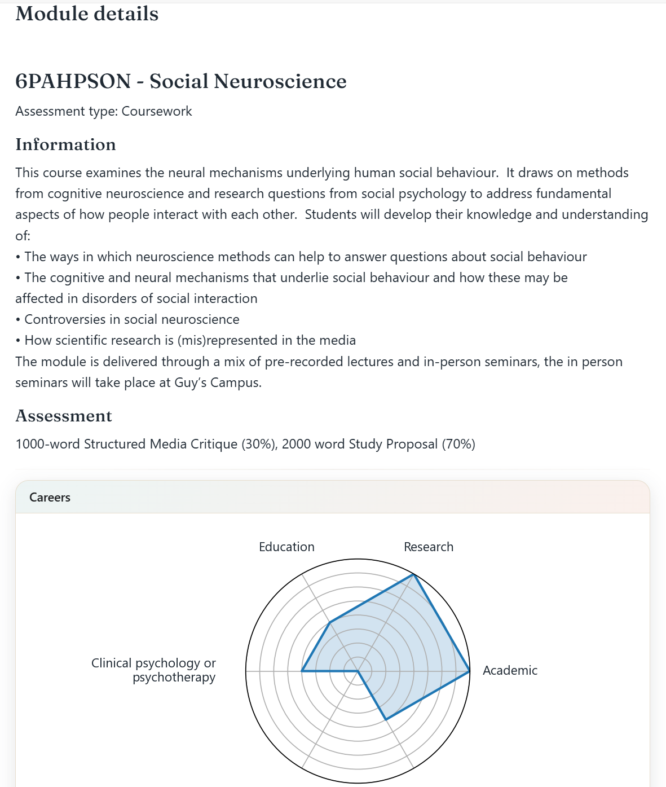
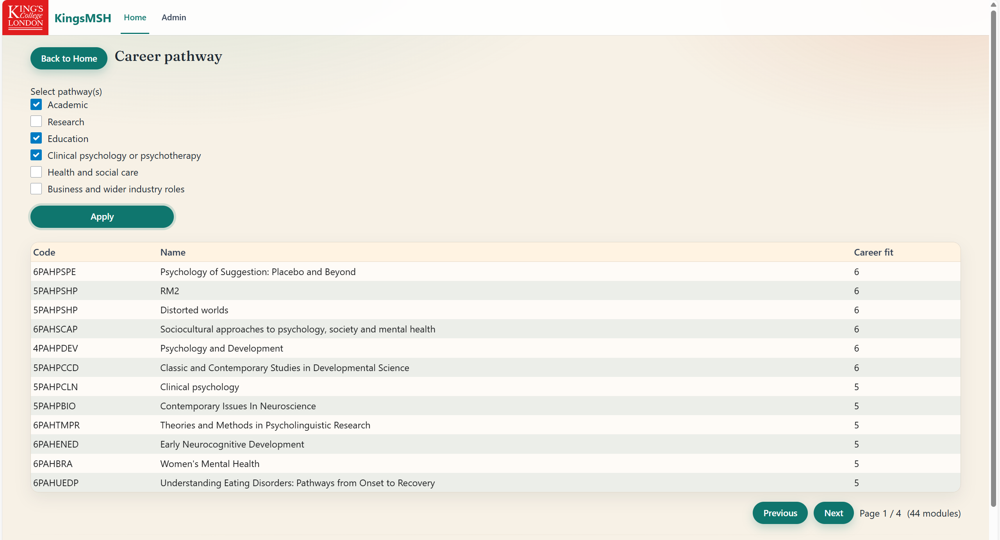
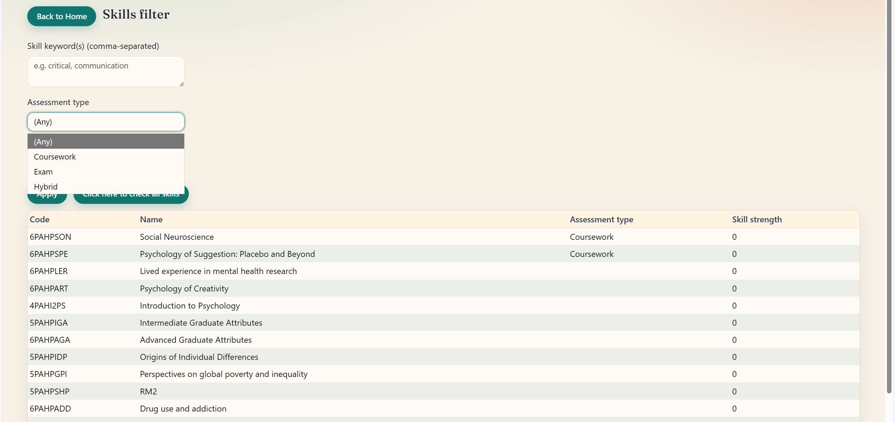
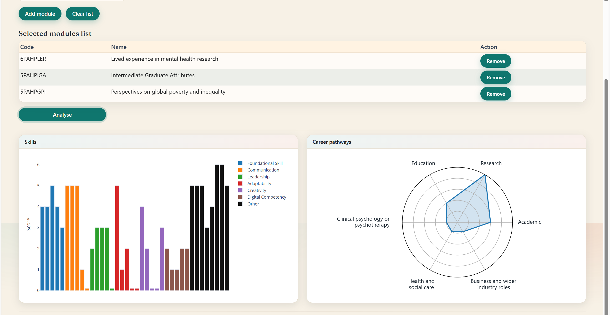

<h1>King's Module Selection Helper (KingsMSH)</h1>

# Features

This tool is designed to help BSc Psychology students choose and analyse their modules.  
For all modules, it demonstrates their description, assessment details, career opportunities, and the skills expected to be trained.

Currently, it allows students to explore future modules from three angles:

* Career pathways (single or mixed pathways)

* Skills (e.g. critical analysis, statistics, etc.)
* Features (e.g. assessment type, topics)

It also allows students to analyse their current modules, providing analysis on career fit and the skills they have learnt.

# How to deploy locally
1. In your **terminal**, `python -m pip install shiny`
2. In your IDE (assuming you are using VS Code), install Shiny
3. Run [app.py](kingsmsh_shinyapp_port/kingsmsh_shiny/app.py)

# How to maintain
All information = [template](kingsmsh_shinyapp_port/kingsmsh_shiny/app_data/templates/0.csv) + [adjustments](kingsmsh_shinyapp_port/kingsmsh_shiny/app_data/adjustments/adjustment.json)

For big edits (e.g. new modules added): Make sure the **SHOW_ADMIN_MENU** is True. Run the app.py, go to the admin tab, browse the file, select the new csv file generated by qualtrics.

For small edits (e.g. update module leads): Make sure the **SHOW_ADMIN_MENU** is True. Run the app.py, go to the admin tab, select the module you want to edit from the scroll down menu, make edits, save the change, save the json file.

When you push the website: Make sure the **SHOW_ADMIN_MENU** has been turned back to **False**.

# Future goals
* ~~Better UI~~
* Visualised sort function for skill training
* ~~Deploy King's API to retrieve user's module selection from their KEATS account. Automatically organise their current modules.~~ DEAD
* ~~Add a function. Read and extract module information from module handbook, automatically compare and correct module information.~~ unnecessary
* Add a function to merge students' feedback with module leaders' expectation.

# Update history
**2026-02-05**  
Now it allows users to explore a skill base before sorting modules by skills.

**2026-02-08**  
Now use Ctrl+A in the welcome page can switch between the frontend and the backend mode. 

**2026-02-09**
Shinyapp supported. 

**2026-02-16**
UI optimised

